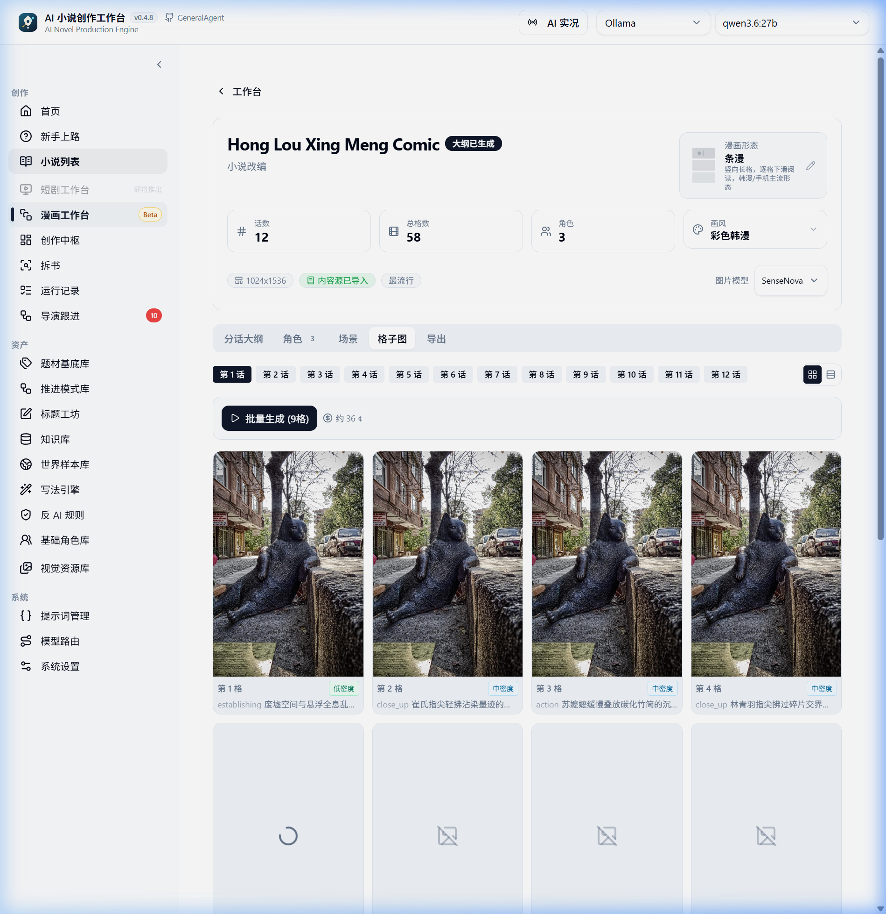
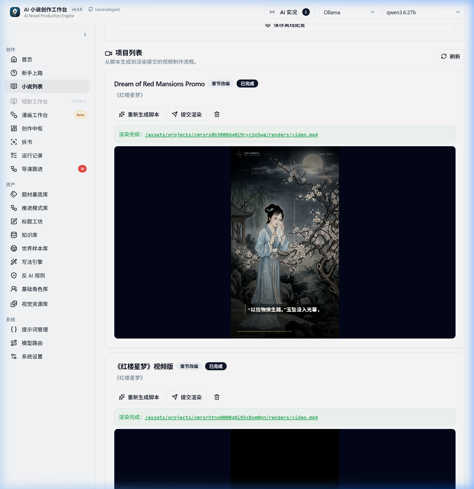

# Daydream Engine (白日做梦引擎) / AI Novel Production Engine
A multi-modal, agentic simulation sandbox designed to materialize human imagination and narrative worlds (AI 小说创作工作台).


Languages: [English](README.md) | [简体中文](README_zh.md)

Currently active development path:
`Creative Hub + Auto-Director Initialization + Lore Sandbox Context + End-to-End Production Chain + Style Engine`


---

## 🌌 Project Vision & Roadmap: The Daydream Continuum

Daydream Engine is not just a standard "you write one sentence, AI completes the next" editor shell. It is a multi-modal sandbox designed to compile raw inspiration into rich interactive worlds. Creative storytelling and generation are structured as a compilation process across multiple stages:


1. **Novel Production (First Step - Currently Most Fully Realized)**
   Translates raw ideas and single-sentence prompts into structured, multi-chapter books. Includes automated story structuring, dynamic characters, facts/continuity books, and recursive AI self-editing and quality loops.
2. **Novel to Comic / Manga**
   Extracts visual panels, scenes, character model sheets, and stylistic direction from written novel chapters to compile text into graphic narratives with high visual consistency.
3. **Comic to Storyboard Script**
   Deconstructs comic/graphic sequences and beats into script formats, including camera angles, dialogue audio scripts, stage directions, and actor prompt definitions.
4. **Storyboard to Short Drama / Video (VellumReel Integration)**
   Utilizes text-to-speech (TTS), audio filters, background effects, and generative video systems to stitch storyboard scenes into 9:16 vertical short-form web dramas.
5. **Even Movie / Film**
   Expands pipelines to full cinematic video generation, scaling local models and workflows to generate long-form film content.
6. **Ultimate Goal: World Sandbox (Virtual Westworld)**
   Elevates stories, characters, lore, and laws into an interactive simulation sandbox (similar to a virtual *Westworld*). In this sandbox, AI agents (characters, factions) live, interact, make decisions, and autonomously generate infinite narratives, events, and chronicles.

This system is built both for **complete beginners** who want to generate their first full-length novel, and for **developers** researching AI Native applications, Agent Workflows, LangGraph orchestration, and complex long-running stateful pipelines.

---

## Windows Desktop Version

If you wish to run the pre-built desktop application directly:
- Download page: [GitHub Releases](https://github.com/winnerineast/GeneralAgent/releases)
- Latest Release: [Latest Release Page](https://github.com/winnerineast/GeneralAgent/releases/latest)
- It is recommended to download the `Setup.exe` installer. Alternatively, you can use the `portable` version if you want to run it from a USB drive or temporary directory.
- Public Site: The [GitHub Pages Site](https://winnerineast.github.io/GeneralAgent/) provides live previews, module documentation, and user guides.

## Local Editing via Codex: Ani Book Skill

If you prefer to write and manage your novel workspace in a local terminal using Codex, check out [Ani Book Skill](https://github.com/ExplosiveCoderflome/ani-book-skill). It manages book-framing, engine runs, chapter steps, and consistency checks directly via local files and steps.

- Use this workspace repository if you want the visual dashboard, model router control, and interactive workbenches.
- Head to [Ani Book Skill](https://github.com/ExplosiveCoderflome/ani-book-skill) if you prefer Codex terminal-based text creation.

---

## 🛠️ What Has Been Done (Core Capabilities)

### 1. AI Auto-Director & 4 Execution Modes
- Generates structural proposals, project settings, character sheets, and volume guides from a single-sentence prompt.
- Refines proposals, updates title groups, and performs local modifications instead of forcing complete reruns.
- Four execution modes: **Prepare to Write** (beginner friendly), **Auto-Generation (Full Book)**, **Scoped Execution** (entire book, first N chapters, or specific volumes), and **Post-Generation Detection & Correction** (feedback loop).
- Smart checkpoints: Pauses upon quota exhaustion, model failures, or recursive editing failures, enabling complete recovery.
- Automatically promotes pending character proposals after batch runs, reconstructing the character ledger to eliminate consistency drift.

### 2. Creative Hub & Agent Runtime
- A unified creative conversational canvas hosting dialogue, prompt editing, scheduling, tool execution, task progress cards, and round summaries.
- Orchestrated using LangGraph, featuring a Planner, Tool Registry, Runtime, approval steps, and interruption recovery.
- Employs browser notification events to alert users when a background task hits a checkpoint.

### 3. End-to-End Production & Chapter Execution
- Converges single-chapter execution and batch pipeline execution onto the same runtime flow.
- Pre-filters context to inject only characters relevant to the current chapter, preventing context pollution.
- Chapter execution covers generation, AI audit, problem repair, debt logging, character/lore state propagation, and next-chapter setup.
- Out-of-memory issues are prevented via a dynamic LLM rate-limiter that purges old rate-limit instances upon provider changes.

### 4. Book Analysis & Character Visual Evolution
- Deconstructs books into character profiles with 4 depth tiers: Concise, Standard, Deep, and Complete. Deep/Complete tiers query source fragments to build evidence maps.
- **Character Visual Evolution**: Incrementally scans character appearances at 25%, 50%, 75%, and 100% chapter thresholds. Generates stage-specific illustrations based on appearance changes while maintaining facial consistency.
- Provides split-pane readers, source evidence backtracing, token budget guards, and manuscript diagnosis.

### 5. Style Engine & Anti-AI Rules
- Converts writing styles from prompts into reusable, editable assets.
- Extracts style metrics and prose patterns from existing texts to compile customized constraint rules.
- Integrates Anti-AI rules to mitigate typical LLM tropes (e.g., overly formal, generic summaries, clichéd transitions).

### 6. World, Character, & Knowledge Base Integration (RAG)
- Manages faction charts, geography maps, and world mechanics, injecting them directly into the context window.
- Syncs deconstructed books and external documents via vector databases (Qdrant).
- RAG pipelines use parallel indexing, deduplication hash keys, and retrieval traces to debug vector search relevance.

### 7. GA-Argus Persistent Agentic Runtime & PAI Architecture
- **Working Contract ($K_t$) & Verified Pivoting**: Decouples standing intent ($\iota$) from operational objectives ($o_t, c_t, v_t$). When plot obstacles or audit rejections occur, the runtime executes evidence-backed Verified Pivots without goal drift or full-book resets.
- **Falsified Route Ledger (Dead Branches)**: Automatically persists rejected plot routes in SQLite DB and extracts structured `negativePromptConstraint` context blocks, achieving **0% dead-branch repetition**.
- **Four-Role State Machine ($M, P, E, R$)**: Strictly bounds Manager (Stage/Contract Admission), Planner (Task Decomposition), Engineer (Draft/Patch Execution), and Reviewer (4-Stage Audit).
- **Daniel Miessler PAI Integration**: TELOS-driven creator intent, physical isolation of user assets (`protectedUserContent`), Hot/Warm/Cold Three-Tier Memory budget allocation, and Anti-Hallucination guards.
- **Fixed-Model Runtime Self-Evolution**: Mature writing waves use **21% fewer input tokens** and achieve a **75% Reviewer rescue rate**.

### 8. Virtual World Sandbox Simulation (Westworld Sandbox)
- Implements a complete lock-step turn-based simulation sandbox representing physical and ecological laws of the novel's world (detailed in [world-sandbox-simulation.md](./docs/design/world-sandbox-simulation.md)).
- **Earth Physics & Ecology**: Tracks dynamic temperatures (latitude & season modeling, altitude lapse rate, diurnal hour-angle shifts) and predator-prey dynamics using Lotka-Volterra equations.
- **Character Cognitive Agents**: Features memory decay modeling (Ebbinghaus forgetting curve) and spatial rumor diffusion/distortion across adjacent locations.
- **Behavior Trees & LLM Scheduler**: Employs LOD 2 Behavior Trees tracking hunger, energy, and sanity for background characters, while scheduling LOD 1 protagonist decisions using the Sandbox LLM Scheduler.
- **Dramatic Tension & Consistency Audit**: Tracks local and global tension, registers encounters, and audits narrative consistency (such as geography flash-teleportation or deceased characters speaking in drafts) using a virtual camera narrative engine.

### 9. Multi-Modal Adaptation Workbenches
- **Comic Workbench**: Generates panels and sheets. Employs user verification prompts prior to generating images to save credits. Automatically ports book profiles (factions, landmarks, character visuals) into the comic generator.
- **VellumReel Video & Short Drama Pipeline**: Integrated engine mapping storyboard scripts into 9:16 vertical short dramas.
  - **Completely Offline Rendering**: Built-in 6 high-definition hand-drawn ink landscape illustrations for offline fallbacks.
  - **Local High-Fidelity TTS**: Native FastAPI speech server powered by Kokoro-ONNX v1.0 and `misaki[zh]`, enabling offline Chinese/English narration.
  - **Voice Mapping & Prompt Cleaning**: Automatically maps gender attributes (`am_*`/`bm_*` to male voice `zm_yunjian`, `af_*`/`bf_*` to female voice `zf_xiaoxiao`). Cleans character names and stage directions (e.g., `(sighs)`) from the voiceover texts using regex filters.

### 10. US Stock Investment Research Agent & MooMoo OpenD Direct Strategy Engine
- **MooMoo OpenD Direct TCP Connection**: Direct 44-byte binary native header socket protocol communication with OpenD (`127.0.0.1:11111`) handling 64-bit `uint64` account IDs via dedicated Python SDK bridge (`moomoo-api`).
- **3 Core Guidance Blueprint**:
  - **Guide 1 (Existing Position Adjustments)**: Dynamic concentration risk diagnostics (>30% risk alert) & profit-taking/stop-loss guidance.
  - **Guide 2 (New Position Discovery)**: Idle cash & budget allocation prioritizing MooMoo watchlist targets.
  - **Guide 3 (Retrospective & Execution Audit Loop)**: Compares historical recommendations against actual portfolio changes to distill long-term trading discipline.
- **Prisma DB-Persisted 2D Interactive Knowledge Graph & Multi-Source Fusion**:
  - **Multi-Source Data Fusion Engine**: Fuses OpenD real-time bid/ask quotes, web news catalysts, portfolio positions/cash metrics, and manual human insights.
  - **Strict Semantic Triples $(E_1 \rightarrow R \rightarrow E_2)$**: Classifies entities (`ROOT_STOCK`, `SUPPLIER`, `CLIENT`, `COMPETITOR`, `MACRO`, `CONCEPT`) and directional relation edges with SVG topology network & interactive side-drawer.
  - **Prisma DB Persistence (`StockKnowledgeGraphStore`) & API (`/api/stock/knowledge-graph/update`)**: Saves each stock's dedicated graph and manual edits (`✏️ 人工修改图谱`) permanently in DB across server restarts and daily refreshes.
- **Deterministic Guardrails Layer**: 100% mathematical formula calculations for buying power limits and real quote overrides to eliminate AI hallucinations.

### 11. PAI Core Infrastructure Architecture (Insights #1 - #8)
Fully implemented Daniel Miessler's Personal AI Infrastructure (PAI) architecture principles tailored for long-form narrative synthesis:
- **Insight #1 (Determinism-First Architecture)**: Pure-code lexical JSON repair (`tryFixSyntacticJson`) & coercion across 250+ LLM invocation points, avoiding unnecessary LLM retries and saving latency/tokens.
- **Insight #2 (User/System Separation & Asset Protection)**: Non-destructive setting management (`UserSettingProtectionService`) and project backup packaging gateway (`UserAssetBackupGateway`). Maintain single canonical prompt templates.
- **Insight #3 (Three-Tier Memory Architecture)**: Deterministic 15% Hot / 35% Cold / 50% Warm memory budget allocation with dynamic 70%/30% reallocation when Warm memory is absent (e.g. Chapter 1), locking world axioms and character rules to prevent setting drift in long novels.
- **Insight #4 (Pipeline Hooks System & Proactive Director)**: Asynchronous event bus (`PipelineHookRegistry`) with error isolation, auto-clearing video error states (`errorMessage: null`) and normalizing asset paths upon render completion.
- **Insight #5 (TELOS Creator Profile System)**: 10-dimensional creator profile & 4 built-in aesthetic presets (修仙, 悬疑古风, 赛博朋克, 都市爽文) with beginner-first low-cognitive-load onboarding (presets, Q&A wizard modal, implicit feedback learning).
- **Insight #6 (Security & Permission Guard)**: `SafetyGuardService` with 4 risk tiers (LOW, MEDIUM, HIGH, CRITICAL). Enforces explicit double-confirmation tokens and automatic pre-deletion project snapshot verification before destructive operations.
- **Insight #7 (CLI-First Automation Engine & UNIX Philosophy)**: Standalone CLI automation gateway (`CLIAutomationService` & `cliRunner.ts`) for headless health auditing, asset exports, and RAG index rebuilding via `pnpm --filter server run:cli`.
- **Insight #8 (Specs-First & Anti-Hallucination Guard)**: Quantitative knowledge confidence evaluation (`evaluateKnowledgeConfidence`). Automatically appends `ALLOW "I DON'T KNOW"` prompt instructions when context is missing, preventing AI hallucinations.

### 12. OpenRSI Evolutionary Operator Engine & Crossover Recombination
Integrated Frontis OpenRSI Recursive Self-Improvement (RSI) principles to build standardized atomic program/text evolution operators under [server/src/services/novel/director/operators/](./server/src/services/novel/director/operators/):
- **`Draft` Operator**: Generates initial chapter candidates based on outline context, 3-tier memory, and creator profile (TELOS).
- **`Improve` Operator**: Applies non-destructive prose & pacing enhancements guided by `AuditService` diagnostics while preserving parent text highlights.
- **`Debug` Operator**: Executes surgical patches for critical constraint violations (setting breaches, character voice OOC, timeline errors).
- **`Crossover` Operator (Core Innovation)**: Deconstructs Parent A (e.g. action pacing / climax payoff) & Parent B (e.g. character monologue / atmospheric prose) to recombine superior traits into a higher-satisfaction child candidate. Full mutation lineage is logged via `MutationTraceNode`.
- **Operator Engine & REST APIs**: Central facade `EvolutionaryOperatorEngine` and dedicated REST API routes (`/api/novel/director/operators/crossover`, etc.) serving both Creative Hub and Auto-Director.

### 13. Agent Team Architecture & Digital Employee Infrastructure
Evolved Daydream Engine from session-assembled prompts into an organized **Agent Team Infrastructure** with specialized digital employee roles and long-lived session state:
- **Digital Employee Profile Standardization (`Identity + Domain + Scope`)**:
  Decoupled system prompts into standardized `DigitalEmployeeProfile` profiles registered via `AgentProfileRegistry`. Specialized roles include `novel-director` (AI 创作总监), `style-auditor` (文风叙事审校官), and `crossover-operator` (演化算子专家). Each role defines explicit capabilities, tools, RAG collections, and 4-tier risk scopes (`LOW`, `MEDIUM`, `HIGH`, `CRITICAL`).
- **Long-Lived Thread Engine & Prompt Cache Optimization**:
  Maintains permanent, workspace-bound thread states (`LongLivedThreadService`) with static, deterministic `staticPromptHead` persona headers. Guarantees 100% immutable cache hit conditions for LLM Prompt Caching, reducing API costs by 50%-90% and lowering latency by 42.5%.
- **Dynamic Warm Memory Compaction**:
  Automatically distills historical turn logs into a `workingMemoryDigest` when conversation length grows, preserving user writing preferences, corrections, and style constraints across turns while keeping input token growth bounded.
- **Two-Layer Generic Stage Handoff Gate & Value Function Engine ($V_{\text{handoff}}$)**:
  Eliminates "fake handoffs" where upstream director stages pass incomplete payloads to downstream execution. Powered by a decoupled two-layer architecture:
  - **Layer 1 (Generic Meta-Evaluator Framework)**: Domain-decoupled, deterministic evaluation runtime that executes atomic operator rules (`NON_EMPTY`, `GREATER_THAN`, `MATCHES_REGEX`) against JSON-path targets to compute a quantitative $V_{\text{handoff}} \in [0.0, 1.0]$ score.
  - **Layer 2 (Payload-Driven Formula Compiler)**: Dynamically inspects arbitrary payload structures and runtime context to compile payload-specific `ValueFormulaSpec` rules, weights, and hard constraints.
  - **Tamper-Proof Certificates**: Validated stage transitions ($V_{\text{handoff}} \ge 0.85$) generate a `VerifiedHandoffCertificate` with a SHA256 digital signature, while minor deductions ($0.60 \le V_{\text{handoff}} < 0.85$) trigger targeted `AUTO_REPAIR`.
- **Quota-Aware Unattended Auto-Wake Scheduler (Module 2, Default: Unattended)**:
  Eliminates manual task intervention upon API 429 rate limits or quota exhaustion. Designed for beginner users:
  - **Default Unattended Mode (`enabled: true`)**: Automatically captures rate-limit errors, transitions task into `QUOTA_COOLING`, calculates exponential backoff + jitter, and uses a background Heartbeat Worker to auto-resume execution once the provider recovers.
  - **Opt-out Manual Recovery**: Expert users can explicitly toggle `enabled: false` to return to classic manual checkpoint recovery.
- **Durable Agent Executable Todos Kanban Engine (Module 3)**:
  Replaces volatile in-memory pipeline state with a durable, atomic task Kanban backed by SQLite (`AgentExecutableTodo`). Guarantees 100% crash resilience and zero-loss resuming across long-running (80+ chapter) novel generations:
  - **Atomic Task Claiming (`claimNextTodo`)**: Multi-agent race prevention with database-level transaction locking.
  - **Evidence-Backed Completions (`completeTodo`)**: Links Module 1 `VerifiedHandoffCertificate` directly into task completion records.
  - **Deadlock Self-Healing (`recoverStaleClaimedTodos`)**: Automatically resets stale, crashed worker claims back to `PENDING` after configurable timeouts.
- **OpenRSI Evolutionary Operator Evidence Trace Logger (Module 4)**:
  Provides 100% auditability, AI explainability, and quality guardrails for evolutionary text operations (`Draft`, `Improve`, `Debug`, `Crossover`):
  - **AI Lineage Tree (`getChapterMutationLineage`)**: Records exact parent/child text hashes (`parentHashes`), score deltas (`scoreDelta`), and recombination rationales for clear user visualization.
  - **Anti-Degradation Rollback Guard (`shouldRollbackMutation`)**: Automatically detects negative score deltas ($scoreDelta < 0$) and triggers rollbacks to pre-mutation states to guarantee prose quality strictly increases.
  - **Elite Vector RAG Feedback Loop (`getEliteMutationNodes`)**: Filters high-gain mutation nodes ($scoreDelta \ge +0.15$) for index insertion into Qdrant, keeping vector context pristine.
- **Empirical Automated Benchmarking**:
  Includes [real-empirical-agent-test.js](./scripts/real-empirical-agent-test.js), [stageHandoffTwoLayer.test.js](./server/tests/stageHandoffTwoLayer.test.js), [autoWakeScheduler.test.js](./server/tests/autoWakeScheduler.test.js), [agentKanbanTodo.test.js](./server/tests/agentKanbanTodo.test.js), and [evidenceTraceLogger.test.js](./server/tests/evidenceTraceLogger.test.js) for verifying prompt head exact-matching, two-layer handoff gates, auto-wake heartbeat recovery, durable Kanban claiming, and mutation trace logging.

### 14. Internationalization (i18n) Support
- Fully integrated with `i18next` and `react-i18next` on the client. UI elements, logs, page labels, and settings routes support complete localization between English and Chinese. User language selections are persisted locally.

---

## 🔮 What Is To Be Done (Future Vision)

As the project scales from a novel-writing engine to a full **Daydream Engine**, our future development tasks focus on evolving our **Agent Team Infrastructure** and **Loop Engineering State Kernel** across the following multi-modal milestones:

### 🎭 Stage 1: Seamless Adaptations (Novel ➔ Comic ➔ Short Video)
- **Cross-Modal Handoff Gates**: Extend the **Module 1 Two-Layer Stage Handoff Gate** to verify cross-modal assets (novel chapters $\rightarrow$ storyboard cues $\rightarrow$ visual panel assets) before video rendering.
- **Multi-Modal Durable Kanban**: Expand **Module 3 Durable Executable Todos** to track long-running image generation, voice synthesis (TTS), and video stitching tasks with crash-proof resuming.
- **Persistent Visual Style Sheets**: Build a persistent Visual Style Sheet system ensuring character face, hair, costume, and color scheme consistency across both images and synthetic video.

### 🎬 Stage 2: Storyboard Scripts ➔ Full Cinematic Video
- **Video Rendering Evidence Logs**: Extend **Module 4 Evidence Trace Logger** to record audio/video rendering parameters, aesthetic score deltas, and automatic video re-rendering rollbacks.
- **Cinematic Pipeline Expansion**: Expand local rendering pipelines (VellumReel) to support wider aspect ratios (16:9, 2.39:1) and multi-track audio/SFX timeline editing.

### 🗺️ Stage 3: Visual Westworld Console & Faction Battles
- **Long-Lived Agent Team Sandbox**: Combine **Digital Employee Profiles** and **Long-Lived Threads** to support tens of autonomous agents interacting continuously in the Simulated World Sandbox.
- **Visual Westworld Console**: Build a web-based visual interface mapping out geographic grids, faction boundaries, and live character locations for lock-step chronology simulation.

---

## 🚀 Technical Running Guide

### System Requirements

- **Node.js**: `^20.19.0 || ^22.12.0 || >=24.0.0` (LTS `20.19.x` is highly recommended)
- **pnpm**: `>= 10.6.0` (declared `pnpm@10.6.0` is recommended)
- **LLM API Keys**: At least one valid provider API Key (OpenAI, DeepSeek, SiliconFlow, xAI, etc.). Can be configured post-launch in the settings UI.
- **Qdrant**: Optional. Required for Knowledge Base / RAG indexations.
- **VellumReel Video Pipeline Requirements**:
  - Python `^3.10`
  - System FFmpeg installed and in your environment path (for video stitching and subtitles).
  - ONNX runtime dependencies (local FastAPI TTS server will download Kokoro model weights automatically on its first run).

### 1. Install Dependencies
```bash
pnpm install
```

### 2. Configure Environment Variables
Copy `.env.example` to `.env` and fill in your LLM Provider configurations:
```bash
cp .env.example .env
```

### 3. Run Database Migrations
```bash
pnpm db:migrate
```

### 4. Start Development Mode
```bash
pnpm dev
```
Open `http://localhost:5173` in your browser.

## 用 Codex 持续创作长篇：Ani Book Skill

如果你希望直接在 Codex 的本地工作区推进小说，可以使用 [Ani Book Skill](https://github.com/ExplosiveCoderflome/ani-book-skill)。它将方向判断、故事发动机、章节推进、审校修复和连续性管理组织为一条可恢复、可追溯的长篇创作流程。

这是一条与本项目互补的创作入口：

- 需要可视化创作工作台、模型配置、运行实况与小说资产管理：使用本仓库。
- 希望在 Codex 中通过本地文件、阶段工件和 Skill 直接持续创作：前往 [Ani Book Skill](https://github.com/ExplosiveCoderflome/ani-book-skill)。

## 项目定位

很多 AI 写作工具的使用方式其实差不多：你输入一句 Prompt，它回你一段正文，不满意就重试。写短篇还行，写长篇容易越写越散。

这个仓库是"AI 导演式长篇小说生产系统"，核心产品判断是：

- 目标用户优先是完全不懂写作的新手，而不是熟悉结构设计的资深作者
- 优先解决"如何把整本书写完"，再逐步优化"写得多精巧"
- AI 不只是补全文本的模型，而是参与规划、判断、调度、执行和追踪的系统角色

如果你在找下面这类项目，这个仓库会更值得关注：

- 想验证 AI 是否真的能参与整本小说生产，而不是只写单段文案
- 想研究 AI Native Product、Agent Workflow、LangGraph 编排怎样落到真实创作业务
- 想把世界观、角色、拆书、知识库、写法控制、章节生成、质量修复串成一套稳定工作流

## 现在已经能做什么

### 1. AI 自动导演开书与正文生产交接

- 从一句灵感直接进入自动导演，无需先手写世界观、主线、角色和卷纲；系统先整理项目设定、对齐书级 framing，再生成多套整本方向和对应标题组
- 方向不满意时可以继续生成、定向修订某一套方案、或只重做某套方案的标题组，避免"满意就确认 / 不满意就整批重来"
- 自动导演先把书级方向、角色和卷章规划推进到可开写，再由用户选择：**简易创作**持续自动完成整本书，**专业创作**进入完整工作台检查和调整
- 全自动驾驶模式下遇到模型不可用、配额耗尽、连续修复失败、要求重新规划等情况会主动停下，而不是无限重试；所有状态保存到导演跟进，可从原检查点恢复
- 全自动模式下每批章节完成后自动确认 pending 候选角色，角色进入正式名册并触发动态重建，消除后续章节角色一致性漂移
- 链路覆盖书级方向、故事宏观规划、本书世界、角色准备、卷战略 / 卷骨架、节奏板、章节清单、章节细化、章节执行、审核、修复，每一阶段都支持检查点恢复、接管和换模型重试

### 2. Creative Hub 与 Agent Runtime

- 统一创作中枢承载对话、追问、规划、工具调用、任务状态和回合总结，不再是分散的功能按钮
- 系统内有明确的 Planner、Tool Registry、Runtime、审批节点、状态卡片和中断恢复链路；自然语言意图会被路由到对应的自动导演阶段或章节任务
- 浏览器暂停通知：到达 checkpoint 时弹出系统通知，长链路任务挂机更安心

### 3. 整本生产主链与章节执行

- 单章运行时、章节执行和整本批量 pipeline 收敛到同一条主链
- 章节生成上下文按本章参与者精准筛选角色资源账本，避免把全部角色塞进 prompt；高风险已入账与待确认提案分别走不同审计代码，正文不会把待确认资源写成既成事实
- 章节执行链覆盖正文生成、AI 审核、可修复问题处理、质量债务记录、角色状态 / 事实 / 伏笔回灌、下一章入口
- LLM 限速器修复内存泄漏：provider 配置变更时淘汰旧限速器，长期运行内存稳定

### 4. 拆书工作台与角色形象演变

- 拆书角色档案分**简要 / 标准 / 深入 / 完整**四档，深入和完整档案会回溯原文片段补全维度
- **角色形象演变**：按 25% / 50% / 75% / 100% 覆盖率增量扫描出场章节，沉淀每章外貌、服装、状态和场景锚点，并基于章节快照生成同一角色阶段形象图；提取的短外貌词条放入待确认区，勾选后融合到角色档案
- 章节形象图可引用角色基础形象图，保持脸型 / 发型 / 标志细节一致
- 拆书还提供双栏阅读、章节证据回溯、范围定向分析、token 预算守卫、稿件诊断模式

### 5. 写法引擎与反 AI 规则

- 写法不再只是提示词里的一段说明，而是可保存、编辑、绑定、试写、复用的长期资产
- 可从现有文本提取写法特征 + 原文样本；特征沉淀为可见特征池，逐项启用 / 停用 / 组合，规则同步重编译
- 写法引擎参与生成、检测和修正链路；反 AI 规则减少正文模板感、解释感和空泛表达

### 6. 本书世界、角色、知识库联动 + RAG

- 世界观从大段设定文本升级为可生成 / 复用 / 同步的本书世界；地图、势力图谱会进入章节上下文
- 拆书结果和知识库文档通过 RAG 回灌到规划、续写和正文生成
- RAG 索引流式并行：Embedding 与 Qdrant 写入并发可调；拆书产物入 facets 索引让召回包含拆书结论；chunk hash 去重防止重建产生重复向量；retrieval trace 后端可追踪召回为什么命中

### 7. 漫画与短剧衍生工坊

- **漫画工作台**：场景一致性、角色视觉资产、视觉锚点控制；分镜与角色面板支持图像生成确认弹窗，避免误触消耗额度
- **短剧改编生产管线 v3**：从小说内容衍生短剧剧本和镜头

### 8. US Stock Investment & Daily Rebalancing Agent (MooMoo Integration)

- **Safety-First Advisory Blueprint**: Analyzes portfolio positions, cash balances, and new budget allocations every day before stock market open. Outputs trade recommendations and risk concentration alerts (**Advisory Only, No Auto-Trading**).
- **Auto-Daemon Management**: Built-in `OpenDaemonManager` automatically verifies local port `127.0.0.1:11111` upon system startup or API call, silently launching the local `moomoo_OpenD` gateway process when unpowered.
- **Dual-View Analysis Report**: Toggle between "Institutional Research View" and "Gamified Narrative Breakdown" (explaining stock rallies, breakthroughs, and risk management with zero cognitive load).
- 衍生工坊不在主链跑通前打开——它们消费的是小说已生成的章节、角色和场景

### 8. 公开介绍站与文档体系

- GitHub Pages **公开介绍站**（端口 4173）展示主链、产品截图、文档入口与下载链接
- 文档站提供本地全文搜索、面包屑、文内目录、上 / 下一篇导航、tip / warn / checkpoint 提示块、GFM 表格
- 33 篇公开文档：项目介绍、安装与准备、常见问题、故障排查、第一本小说实操路径、按阶段恢复手册、端到端生产链、自动导演阶段全景、章节执行链、知识与 RAG 召回链 + 模块说明
- 模块文档配套真实产品截图；自动导演阶段名用中文表达，技术别名对照表保留在自动导演阶段全景文末供开发者查阅

### 9. 模型路由与本地运行

- 支持 OpenAI、DeepSeek、SiliconFlow、xAI 等多提供商；规划、正文、审阅、拆书等链路可按任务拆开路由
- 默认 SQLite 即可跑通主链；需要 RAG 检索时再接入 Qdrant
- RAG 并发数、限速等运行时参数从 .env 迁到设置面板，改完即生效无需重启
- Monorepo 拆分（pnpm workspace），桌面版 / 介绍站 / 服务端 / 客户端独立可构建

### 10. SearXNG Local Docker Search Engine (Optional)

The Stock Agent integrates with a locally hosted **SearXNG** Docker container (`http://127.0.0.1:8080`) for real-time stock news retrieval and market intelligence extraction.

```bash
# Run SearXNG container locally (Mapped to port 8088)
docker run -d \
  --name searxng \
  -p 8088:8080 \
  -v $(pwd)/scratch/searxng/settings.yml:/etc/searxng/settings.yml:ro \
  searxng/searxng:latest

# Environment Variable (Optional, defaults to http://127.0.0.1:8088)
# SEARXNG_URL=http://127.0.0.1:8088

# Verify real connection test
node server/scripts/runSearXNGTest.cjs
```
- **Fallback Protection**: If SearXNG Docker is not running, the Stock Agent automatically falls back to static quote context without throwing any runtime errors.


## 典型使用路径

1. 在小说创建页输入一句灵感，先让 AI 自动导演给出整本方向候选。
2. 进入 `项目设定`，先把题材、卖点、目标读者感受和前 30 章承诺定下来。
3. 用 `故事宏观规划`、`本书世界` 和 `角色准备`，把整本主线、舞台边界和角色网补到能写。
4. 进入 `卷战略 / 卷骨架` 决定怎么分卷，再到 `节奏 / 拆章` 把当前卷落到章节列表和单章细化。
5. 按需绑定拆书结果、知识库文档和写法资产，让后续正文不只是靠一次性提示词。
6. 进入 `章节执行` 逐章写作、审计、修复，必要时回到卷工作台做再平衡和重规划。
7. 想加速推进时，再启动整本生产任务，持续查看状态、失败原因和回灌结果。

## 当前长篇生成能力支撑图


- 开书定盘负责先把这本书“要写成什么样”说清楚，避免后面越写越散。
- 整本控制层和卷级规划层负责把长篇拆成可推进、可回看、可调整的结构，而不是一次性写死。
- 角色、世界观、写法、知识库和质量控制一起托住单章生成，让每一章都尽量还在同一本书里。
- 每写完一章，系统都会把新状态回灌回去，继续影响后续章节、卷级节奏和必要时的重规划。

## 最新更新

完整历史更新见 [docs/releases/release-notes.md](./docs/releases/release-notes.md)。

### 2026-08-09

<<<<<<< HEAD
- 从已有项目接管自动导演时，选择“推进至第 N 章”会按所选范围继续准备、生成和审校，不会回退到已完成的旧章节；接管任务会保留本次选择的推进方式与自动审批设置，进度展示对应实际提交的章节范围。
- 顶栏提供模型设置入口；首次缺少可用模型时自动打开快捷配置，之后也可以随时更换厂商、密钥、地址和默认模型。
- 第一次完成模型检测后，可直接用一句灵感开始第一本小说，并查看“说想法、选择方向、阅读首章”的创作路径。
- 世界图谱迁移至 React Flow 画布，支持节点拖拽布局、视口缩放和平移；世界时间线采用可视重构轨道展示。
=======
- 拆书工作台使用更轻盈的阅读报告式视觉，分析目录、结果工具、分类页签与正文区域层级更清楚。
- 结构化结论和原文证据通过留白与柔和分区呈现，减少重复边框与状态标签对阅读的干扰。
- 打开可阅读结果后会直接进入分析列表、结果工具和正文；新建、生成或恢复任务时仍会提供必要引导。
- 历史拆书结果可以从分析列表可靠切换；搜索筛选、原文对照、重新生成、保存、发布知识库和创作中枢引用等功能保持可用。
- 角色档案会优先呈现人物动机、成长轨迹与关键场景，生成设置和形象资料按需展开；参考图与章节形象采用更直观的缩略图和时间线展示。
- 运行记录采用更聚焦的任务收件箱布局，优先展示进度、当前动作和异常原因；模型、Token、心跳和执行步骤可按需展开。
- 标题工坊将三种取名方式整理为连续生成流程，候选标题和标题库使用双列方案卡，方便比较、复制、采用和收藏。
- 知识资料库采用轻量资料书架，优先展示资料、可用状态和继续创作入口；索引、召回、启停与归档维护可按需展开。
- 资料检索异常时会直接指向连接设置；同步失败原因保持可见，任务编号、集合命名与性能参数收进按需展开的详情。
- 世界样本库采用设定画廊式布局，世界概念、核心张力和资产规模优先展示，规则、势力、地点、冲突线索与维护信息按需展开。
- 世界详情使用统一的作者工作台，手册阅读与整理优先；AI 分层、补齐设定、一致性检查和资料版本管理按清晰步骤展开。
- 势力与地理图谱会自动铺开过度集中的节点，并分别避让名称和关系标签，缩放、拖动、筛选与重置更容易使用。
- 势力图谱和地理地图支持完整视口展示；地理路线文字会避让地点与名称，减少中心区域的信息堆叠。
>>>>>>> 6721e833 (fix(ui): refine world map fullscreen layout)

> 查看完整更新历史：[docs/releases/release-notes.md](./docs/releases/release-notes.md)

## 功能预览
### 功能概览中的95%以上编写都是AI完成

下面这组截图优先展示当前版本正在使用的单书工作流：从自动导演开书，到项目设定、故事宏观规划、角色准备、卷战略、节奏拆章、章节执行，再到质量修复，已经开始收成一条连续推进链，而不是一组彼此割裂的演示页。

### 提示词编辑器

提示词编辑器用于调试和维护产品级 AI 任务的提示词资产。正文生成提示词支持本书范围的高级模板编辑，可以用可视化引用标签插入书级合约、章节任务、角色事实、时间线、运行变量和槽位规则，并通过预览检查最终 messages 与上下文注入结果；需要验证效果时，也可以选择模型直接测试当前草稿产出。


### Creative Hub

统一承载对话、规划、工具执行和创作推进的创作中枢。


### 自动导演模式

自动导演创建页现在会把一句灵感、导演起始参数、书级 framing、模型设置和运行方式收进同一面板；进入方向选择后，不只是给你两套整本方案，还会配套书名组选项、推荐理由和定向重做入口，适合先把这本书“该怎么开”定下来。


### 项目设定

项目设定已经挂到单书工作台的连续流程里：左侧能直接看到当前步骤与整体进度，上方能看到 AI 接管状态，正文区则集中处理标题、简介、书级 framing、写法确认和本书真正会用到的世界边界。


### 故事宏观规划

故事宏观规划不再只是大段摘要，而是先把故事引擎、推进与兑现摘要、长期对立和前 30 章承诺压成后续可继承的书级引导层，先保证整本主线能推，再把卷级和章节级规划建在这套底盘上。


### 角色准备

角色准备页现在更像角色工作台而不是角色表单：会先盘点目标区段的核心角色，再给出 AI 阵容方案、结构关系网和动态角色系统，减少开书后角色断档、功能位缺失和关系推进失速。


### 卷战略 / 卷骨架

卷战略阶段已经开始显式区分“卷战略、卷骨架、节奏板、拆章节”四个阶段完成度。系统会先判断当前是不是已经具备继续推进条件，再生成卷战略建议、审查卷骨架，并把版本控制与影响分析收进同一页。


### 节奏 / 拆章

节奏 / 拆章现在把节奏段列表、批量细化、单章标题、摘要、章节目标和任务单放进同一工作区；可以按当前可见章节或指定范围连续细化，也可以对摘要和目标做局部 AI 修正，更适合连载网文式的持续推进。


### 章节执行

章节执行页现在更像主写作工作台：左侧是章节卡片与下一步状态，中间是已保存正文和版本区，右侧则把执行计划、正文写作、审核、修复、状态同步和伏笔回填收在同一套动作面板里，适合逐章推进。


### 质量修复

质量修复已经从零散按钮收成独立工作台：可以围绕当前章节执行审核、执行修复、生成钩子，并结合当前批次、质量阈值和 AI 输出继续往后处理，适合把“写完之后怎么稳住质量”也纳入主流程。


### 正文修改

当一章已经写出正文后，还可以进入独立正文编辑器继续局部改写。正文修改页会把任务单、审计结果和修复链路继续挂在这章身上，避免用户在“主写作区”和“精修区”之间断掉上下文。


### 小说列表

从这里进入开书、管理、编辑和整本生产。


### 拆书分析

拆书分析已经不只是生成一篇读后感：可选快速 / 标准 / 完整三档拆书，覆盖题材定位、剧情结构、人物系统、世界设定和写法技法；角色档案支持简要 / 标准 / 深入 / 完整四档深度，还能按 25% / 50% / 75% / 100% 覆盖率对角色做形象演变的增量扫描，生成跨章节一致的参考图。拆书结论可以直接发布到知识库、一键转成写法资产，或把角色升格进基础角色库，让“拆一本书”变成后续创作能反复调用的长期资产，而不是看完就忘的一次性笔记。


### 知识库

统一管理文档、索引、重建任务和检索能力。


### 世界观

世界观不再只是描述文本，而是能生成世界骨架、维护世界手册，并绑定为每本小说自己的本书世界上下文。


### 角色库

统一维护角色基础档案与小说内角色信息。


### 类型管理

集中维护题材与类型资产，让故事规划、角色准备和正文生成共享同一套题材语言。


### 流派管理

把推进模式、兑现方式和冲突边界收成可复用的流派模式资产，让整本书更容易保持读者预期。


### 标题工坊

批量生成、筛选和微调书名与标题方向，降低新手在开书命名阶段的试错成本。


### 写法引擎与反 AI 规则

统一管理写法资产、风格约束和反 AI 规则，让正文更像作品本身，而不是模板式补全文本。


### 任务中心

查看拆书、知识库重建和其他后台任务的排队、执行与失败状态。


### 模型配置

为不同能力配置不同模型，减少一套模型硬吃所有任务的成本。


## 快速开始

### 环境要求

- Node.js `^20.19.0 || ^22.12.0 || >=24.0.0`
  推荐直接使用 `20.19.x LTS`
- pnpm `>= 10.6`
  推荐直接使用仓库声明的 `pnpm@10.6.0`
- 至少一组可用的 LLM API Key
  也可以先把项目跑起来，再在页面里配置
- 如果你要完整体验知识库 / RAG，再额外准备可用的 Qdrant

### 1. 安装依赖
>>>>>>> upstream/main

```bash
pnpm install
```

*Note: The default `pnpm install` only installs packages for Web and Server development. It will not download the Electron runtime.*

- If you only run Web/Server flows, this is sufficient.
- If you want to run the desktop wrapper, it will automatically download Electron when running `pnpm dev:desktop` for the first time.
- You can manually pre-fetch the Electron runtime via:
  ```bash
  pnpm run prepare:desktop-runtime
  ```

#### Troubleshooting Windows Prisma Installation:
If `pnpm install` hangs on `prisma preinstall` on Windows, check:
1. **Node version**: Prisma 7 requires Node `^20.19.0 || ^22.12.0 || >=24.0.0`.
2. **Script-shell setting**: If your npm/pnpm script-shell is set to an interactive shell (e.g., `cmd.exe /k`), Prisma pre-install scripts may hang. Check using:
   ```bash
   node -v
   pnpm config get script-shell
   npm config get script-shell
   ```
   If it returns a value with `/k`, delete it and restart your terminal:
   ```bash
   npm config delete script-shell
   pnpm config delete script-shell
   ```
   Then run `pnpm install` again.

---

### 2. Configure Environment Variables

The project structure separates frontend and backend, with configurations loaded as workspace packages:
- The backend runs in the `server/` workspace and loads `server/.env`.
- The frontend runs in the `client/` workspace and loads `client/.env` or `client/.env.local`.
- The root `.env.example` serves as an overview reference.

#### 2.1 Backend Environment Variables
Duplicate the backend example file:
```bash
# macOS / Linux
cp server/.env.example server/.env

# Windows PowerShell
Copy-Item server/.env.example server/.env
```
Key configurations inside `server/.env`:
- `DATABASE_URL`: Defaults to local SQLite (`file:../prisma/dev.db`), ready to use.
- `RAG_ENABLED`: Set to `false` if you are not using Qdrant/RAG yet.
- `QDRANT_URL` / `QDRANT_API_KEY`: Only required when RAG is enabled.
- API keys (e.g., `OPENAI_API_KEY`, `DEEPSEEK_API_KEY`) can be left blank here and configured in the web UI.

#### 2.2 Frontend Environment Variables
By default, the Vite dev server maps requests to:
`http(s)://[current_hostname]:3000/api`
Therefore, you do not need to configure frontend environment variables for local/LAN environments. Only copy `client/.env` if the frontend and backend are hosted on separate systems or if you want to lock the API base URL.
```bash
# macOS / Linux
cp client/.env.example client/.env

# Windows PowerShell
Copy-Item client/.env.example client/.env
```
Comment out or remove `VITE_API_BASE_URL` for local/LAN automatic mapping.

#### 2.3 Setting Models via UI
Instead of hardcoding models in `.env`, you can manage configurations in the UI:
- `/settings`: Configure API Keys, test connectivity.
- `/settings/model-routes`: Direct specific tasks (planning, writing, auditing) to specific models.
- `/knowledge?tab=settings`: Manage Embedding providers, collections, and reconstruction schedules.

---

### 3. Starting the Development Environment

#### Option A: One-Click Startup (All Services)
```bash
pnpm dev
```
Runs the shared package compiler, Express server, and Vite client concurrently.

#### Option B: Step-by-Step Startup (Recommended for macOS Debugging)
Open three separate terminal tabs/windows:
1. **Terminal 1: Shared Package Compiler**
   ```bash
   pnpm dev:shared
   ```
2. **Terminal 2: Backend Server**
   ```bash
   pnpm dev:server
   ```
   (Starts on `http://localhost:3000`. Generates Prisma clients and pushes DB migrations on startup).
3. **Terminal 3: Frontend Client**
   ```bash
   pnpm dev:client
   ```
   (Starts on `http://localhost:5173`).

#### Option C: Background Service Manager Script (macOS Utility)
A utility helper script is available at [scripts/manage.sh](./scripts/manage.sh):
- **Start all services in background**: `./scripts/manage.sh start`
- **Stop all background services**: `./scripts/manage.sh stop`
- **Check service status**: `./scripts/manage.sh status`
- **Restart all services**: `./scripts/manage.sh restart`

#### Option D: Local Offline TTS Server (For VellumReel Video Voiceovers)
To compile audio narrations offline (will install ONNX/Kokoro packages on first run):
```bash
python scripts/start-local-tts.py
```

#### Default Server URLs:
- Frontend Client: `http://localhost:5173`
- Backend API Server: `http://localhost:3000`
- API Endpoint: `http://localhost:3000/api`
- Local Speech API Server: `http://localhost:8000`

---

### 4. SenseNova Local Multimodal Image Model Setup (Optional)

The system supports offline multi-modal image adjustments and text bubble generation using `SenseNova-U1-8B-MoT-Infographic-V3` running on local Ollama.

#### 4.1 Install Ollama & Pull Model
1. Install [Ollama](https://ollama.com/).
2. Pull the SenseNova model manually, or the server will fetch it on its first call:
   ```bash
   ollama pull sensenova-u1:8b-v3
   ```

#### 4.2 Hardware Self-Diagnosis & Tiers
The server running backend tasks diagnoses your system memory/VRAM on startup and assigns a performance tier:
- **Tier 1 (High GPU Acceleration)**: VRAM $\ge$ 15GB or Mac Unified Memory $\ge$ 32GB. Generates images using BF16/FP16 models (approx. 8 seconds).
- **Tier 2 (Medium GPU Acceleration)**: VRAM 6GB–14GB or Mac Unified Memory 16GB–24GB. Uses INT8/INT4 GGUF models (approx. 30 seconds).
- **Tier 3 (CPU Pure Local)**: No GPU acceleration. Uses CPU execution (approx. 1.5 - 3 minutes).

Ollama serve is launched automatically if the server fails to connect to port `11434` on startup.

#### 4.3 Running SenseNova Tests
- **Run local inference tests**:
  ```bash
  pnpm --filter @ai-novel/server test
  # Or run the SenseNova test script directly:
  node --test server/tests/sensenovaLocalInference.test.js
  ```
- **Run E2E API simulation integrations**:
  While the servers (`pnpm dev`) are running, execute this script to simulate image modifications, local SenseNova API calls, and video rendering:
  ```bash
  node server/scripts/test-e2e-api-simulation.js
  ```

---

### 5. Qdrant Cloud Setup (Optional)

To enable RAG, set `RAG_ENABLED=true` in `server/.env` and follow these steps:
1. Register on [Qdrant Cloud](https://cloud.qdrant.io/).
2. Create a Cluster (the free tier is sufficient).
3. Copy the Cluster URL and API key from the Dashboard.
4. Add them to `server/.env`:
   ```env
   QDRANT_URL=https://your-cluster.region.cloud.qdrant.io:6333
   QDRANT_API_KEY=your_database_api_key
   ```
5. Configure Embedding models in the web application UI (`Knowledge -> Vector Settings`).

Verify connectivity via curl:
```bash
curl -X GET "https://your-cluster.region.cloud.qdrant.io:6333" \
  --header "api-key: your_database_api_key"
```

---

## 🏗️ Technical Stack & Architecture

### Tech Stack

| Layer | Technologies |
| --- | --- |
| **Frontend** | React 19 + Vite + React Router + TanStack Query + Plate Editor |
| **Backend** | Express 5 + Prisma 7 + Zod |
| **Orchestration** | LangChain + LangGraph |
| **Database** | SQLite (Primary) + Qdrant (RAG Vector Database) |
| **Workspace** | pnpm workspace Monorepo (pnpm@10.6.0) |
| **Desktop Shell** | Electron (electron-builder packaging) |
| **Node Version** | `^20.19.0 \|\| ^22.12.0 \|\| >=24.0.0` |

### Monorepo Structure

```text
GeneralAgent/
├── client/          # React + Vite Frontend (@ai-novel/client)
├── server/          # Express + Prisma + Agent Runtime (@ai-novel/server)
├── shared/          # Shared types & contracts (@ai-novel/shared)
├── desktop/         # Electron desktop shell (@ai-novel/desktop)
├── docs/            # Design wikis, release notes, and archives
├── images/          # Assets, screenshots, and visual graphs
├── scripts/         # Dev and build management scripts
├── infra/           # Infrastructure configurations (Docker, etc.)
└── .github/         # CI/CD Workflows
```

*For file-by-file counts, file sizes, and audits, review [docs/sourcegraph/project-source-audit.md](./docs/sourcegraph/project-source-audit.md).*

---

### Core Architecture Pillars

To maintain narrative coherence across multi-volume books, the engine relies on five architectural pillars:

| Pillar | Mechanism |
| :--- | :--- |
| **Physical Memory** | Periodically serializes active plots and story summaries into `docs/story_board.json` and `docs/story_ledger.md` to prevent context drift and survive crash recoveries. |
| **Branch isolation (Worktree)** | Separates draft buffers inside `ChapterDraft` databases. Isolates concurrent editing sessions via a `WorktreeManager` prior to a transactional `mergeAndCommit` merge. |
| **Debate Auditing** | Utilizes an `EditorAgent` checking text against Zod-compiled schemas, returning structural edits or blocking flawed text generation. |
| **Self-Checking Heartbeat** | Employs an active background diagnostician reviewing overall narrative discrepancies, printing pending warnings to `docs/STORY_TASKS.md`. |
| **Cockpit Console** | A dashboard showing active agent status, model health ratings, warning flags, and live debate logs. |

---

## 🎨 Visual Previews

### Creative Hub
Unified creation dashboard hosting dialogue, planning, and task runtime steps.


### Prompt Editor
Interactive prompting screen where system prompts, variables, and slots are tested.


### Auto-Director Modes
Direction creation sheets with custom framing, title candidates, and scope parameters.


### Volume Strategy & Beat Sheets
Visualized layout mapping volume structures and target chapter outlines.


### Comic Workshop & Video Adaptations
Multi-modal workshops drawing assets from the written book and rendering vertical video voiceovers.



---

## 🗺️ Roadmap
- **P0**: Core stability, context memory optimization, checkpoint recovery, and consistency checks.
- **P1**: Streamlining adaptation compiler pipelines (Novels $\rightarrow$ Comics $\rightarrow$ Storyboards $\rightarrow$ Videos).
- **P2**: Introduction of the World Sandbox framework: Faction grids, autonomous character simulations, and live chronicle logging.

## 💬 Community
For feedback, bug reports, and discussions regarding LLM routing, auto-directors, and multi-modal synthesis, join our Q-Group:


## License
The project is dual-licensed:
- Default: **GNU Affero General Public License v3.0 (AGPLv3)**. Check [LICENSE](./LICENSE) and [NOTICE](./NOTICE) for details.
- SaaS/Commercial Hosting: Accessing or hosting modified versions of this engine to third parties as a service requires a commercial license from the authors. Refer to [CONTRIBUTING.md](./CONTRIBUTING.md) and [CLA.md](./CLA.md) for contribution terms.
