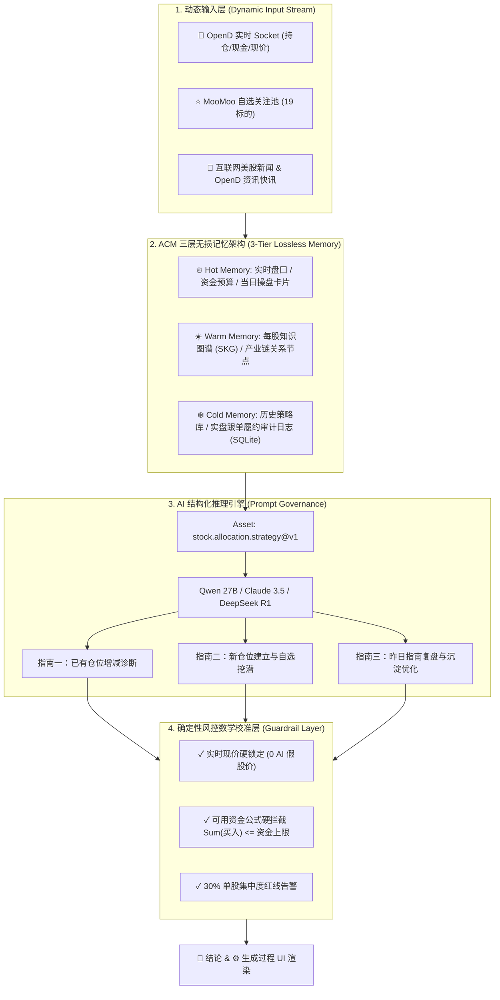

# 🏛️ 基于 ACM (Agentic Context Management) 的美股投研智能体上下文管理与深度架构设计方案

> **论文参考**：*ACM: Agentic Context Management for Long-Horizon Tasks* (CMU & Meta - Xiaochuan Li et al., 2026, [arXiv:2607.23809](https://arxiv.org/abs/2607.23809))

---

## 一、 背景与痛点分析：长周期金融投研中的上下文漂移与认知过载

在美股量化投研与个人操盘场景中，智能体（Agent）面临着典型的高维度、长周期、大吞吐数据流。传统大模型应用在处理该场景时存在三大致命缺陷：

```
[原始金融数据流]
 (OpenD Tick/L2 + SEC 财报 + FOMC 决议 + 实时新闻 + 历史持仓成交)
                          │
         ┌────────────────┴────────────────┐
         ▼                                 ▼
【传统方案 A：全量堆叠 Prompt】      【传统方案 B：滑动窗口滑动截断】
 • Token 上限爆表、高延迟高成本       • 丢弃历史成本价与上次止损线
 • "Needle in a Haystack" 遗忘      • 导致前后策略矛盾，缺乏连续性
 • 产生 AI 价格与交易逻辑幻觉        • 无法归因长周期投资复盘
```

### 痛点 1：全量新闻堆叠导致注意力分散（Context Pollution）
金融新闻每日数十万字，直接将原始文本放入 Prompt 会导致大模型无法精准捕捉真正具备**股价催化效应（Catalyst）**的核心线索。

### 痛点 2：滑动窗口截断破坏策略连续性（Lossy Truncation）
如果对历史对话或日志采用简单截断，智能体会丢弃上周的建仓成本价、上次设定的止损防线以及用户的历史风险偏好，导致“今天推荐买入、明天建议清仓”的逻辑矛盾。

### 痛点 3：缺乏履约复盘与自我进化（Lack of Retrospective Loop）
传统 Agent 只输出一次性建议，不追踪用户在 MooMoo 客户端中的**真实挂单与成交履约率**，无法将过去的交易得失转化为可长效继承的**交易纪律（Trading Disciplines）**。

---

## 二、 ACM 核心范式在美股投研 Agent 中的降维移植

ACM 论文提出了两大核心命题：**Agent-Native（智能体自主感知上下文压缩时机）** 与 **Lossless Persistence（无损外部磁盘持久化与回溯）**。我们将这两大哲学深度融合至美股投研 Agent 架构中：



---

## 三、 ACM 三层无损记忆架构 (3-Tier Lossless Context Memory)

针对金融数据的时效性与重要度分层，设计如下三层记忆模型：

| 记忆层级 | 存储载体 | 包含数据内容 | ACM 管理机制 | Token 预算占比 |
| :--- | :--- | :--- | :--- | :--- |
| **Hot Memory (热记忆)** | 内存 / React State | 本地 OpenD 实时现价、闲置现金、新增预算、当日 3 大指南卡片 | **实时刷新**：随着 OpenD TCP Socket 推送秒级更新 | 20% |
| **Warm Memory (温记忆)** | 结构化 SKG 向量/JSON | 每股知识图谱（产业链上下游、竞争对手、近 7 日核心新闻催化剂） | **Agent-Native 自主压缩**：由 Agent 自动将数万字新闻提炼为结构化关系图谱节点 | 35% |
| **Cold Memory (冷记忆)** | SQLite / Prisma 持久化 | 历史全量策略记录、MooMoo 真实成交追踪、复盘跟单率审计日志 | **Lossless 无损落库**：永不删除，在需要复盘和长效纪律提炼时精准无损检索 | 45% |

---

## 四、 详细模块设计与数据流规范

### 1. 每股知识图谱提炼模块 (Per-Stock Knowledge Graph Distiller)

#### 数据结构 Schema (`StockKnowledgeGraphItem`)
```typescript
export interface StockKnowledgeGraphNode {
  relation: string;      // 关系类型 (如: "上游晶圆代工供应商", "核心下游云巨头客户", "宏观利好驱动")
  targetNode: string;    // 关联节点 (如: "台积电 TSMC (2330.TW)", "微软 Azure")
}

export interface StockKnowledgeGraphItem {
  symbol: string;                       // 股票代码 (如 "NVDA")
  companyName: string;                  // 公司名称 (如 "英伟达")
  positionCategory: "EXISTING" | "NEW_DISCOVERY"; // 属于已有持仓还是新挖潜标的
  industrySector: string;              // 细分产业链 (如 "算力芯片 / AI 硬件产业链")
  newsCatalysts: string[];             // 具备股价催化效应的互联网/OpenD 资讯快讯
  knowledgeGraphNodes: StockKnowledgeGraphNode[]; // 知识图谱节点
  actionAdvice: "BUY" | "SELL" | "HOLD" | "TRIM";  // AI 建议动作
  guidanceText: string;                // 精确研判逻辑
}
```

#### 工作流机制：
1. **数据拉取**：从 OpenD 接口获取持仓（`AAPL`, `AMD`, `AMZN`, `NVDA`, `SPCX`）与自选池（`META`, `INTC`, `SNDK`, `MU`, `NBIS`, `HON`, `VOO`...）；
2. **Context 蒸馏**：Agent 接收美股隔夜新闻与快讯，调用图谱提取 Prompt，抽取**不超过 3 个核心产业链关系节点**与**2 条具备短期催化效能的新闻短语句**；
3. **消除冗余**：避免将全文输入后续主推理流程，实现 90% 以上的 Context 降噪。

---

### 2. 昨日操盘指南 vs 真实成交履约复盘模块 (Retrospective & Execution Audit Subsystem)

ACM 论文指出，模型在长周期任务中的提升关键在于**轨迹复盘与履约纠偏 (Trajectory Resume & Distillation)**。

#### 复盘求导算法与计算公式：

##### (1) 跟单匹配率 (Execution Match Rate)
$$\text{ExecutionMatchRate} = \frac{\sum_{i \in \text{Actions}} \mathbb{I}(\text{ActualShareChange}_i = \text{SuggestedShares}_i)}{N_{\text{Actions}}} \times 100\%$$

##### (2) 避险与收益归因 (Drawdown Mitigation Value)
当昨日建议减仓股票 $S$（例如减仓 AMD 1 股），而今日大盘整体回撤时，计算该建议的**避险效益**：
$$\text{AvoidedLoss} = \text{SuggestedShares}_S \times (P_{\text{Yesterday}} - P_{\text{Today}})$$

#### 复盘指南生成架构：
```
[昨日 AI 策略 JSON] (从 Cold Memory 数据库读取)
         │
         ├─── 对比 ───► [今日 OpenD 实盘持仓快照]
         │
         ▼
[履约差异分析器]
 • 识别未执行指令 (如: 未减仓持仓占比 37.3% 的 AMD)
 • 评估原因: 挂单价格偏差 / 克服 FOMO 心理诱惑
         │
         ▼
[长效纪律蒸馏器 (Rule Distiller)]
 沉淀为固定法则 (例如: "高 Beta 单股占比过 30% 时，开盘前 15 分钟强行挂限价单减仓")
         │
         ▼
写入【指南三】：昨日指南复盘与沉淀优化
```

---

### 3. 确定性风控与数学校准层 (Guardrail Layer)

为了确保 0 AI 股价幻觉与 0 资金爆仓超支，在结构化输出之后接管确定性算法校验：

```typescript
export function applyDeterministicGuardrails(
  rawOutput: DailyAllocationOutput,
  liveQuotesMap: Map<string, number>,
  cashBalance: number,
  customBudget: number
): DailyAllocationOutput {
  const totalAvailableCapital = cashBalance + customBudget;
  let runningBudgetLeft = totalAvailableCapital;

  const calibratedActions = rawOutput.actions.map((action) => {
    // 1. 实时现价硬替换 (0 AI 假股价)
    const livePrice = liveQuotesMap.get(action.symbol) || action.estimatedPrice;

    if (action.action === "BUY") {
      // 2. 资金上限硬拦截：Floor(预算上限 / 实盘现价)
      const maxSharesByCapital = Math.floor(runningBudgetLeft / livePrice);
      const safeShares = Math.min(action.suggestedShares, maxSharesByCapital);
      const safeAmount = safeShares * livePrice;
      runningBudgetLeft -= safeAmount;

      return {
        ...action,
        estimatedPrice: livePrice,
        suggestedShares: safeShares,
        estimatedAmount: safeAmount,
      };
    }

    return {
      ...action,
      estimatedPrice: livePrice,
      estimatedAmount: action.suggestedShares * livePrice,
    };
  });

  return {
    ...rawOutput,
    actions: calibratedActions,
  };
}
```

---

## 五、 UI 视图落地与交互流设计 (`StockStudioPage.tsx`)

在前端渲染中，将 ACM 范式完美落地为三大视图模块：

```
┌────────────────────────────────────────────────────────────────────────┐
│  MooMoo 每日开盘操盘指南                               [📌 结论] [⚙️ 生成过程] │
├────────────────────────────────────────────────────────────────────────┤
│ ┌──────────────────────┐ ┌──────────────────────┐ ┌──────────────────┐ │
│ │ 【指南一】：已有仓位增减 │ │ 【指南二】：新仓位建立 │ │ 【指南三】：昨日指南复盘 │ │
│ │ 诊断 5 笔持仓集中度   │ │ 挖掘 MooMoo 自选池   │ │ 履约率 66.7%    │ │
│ │ AMD 减仓锁利防线     │ │ 建立 VOO 宽基底仓    │ │ 沉淀挂单纪律法则 │ │
│ └──────────────────────┘ └──────────────────────┘ └──────────────────┘ │
├────────────────────────────────────────────────────────────────────────┤
│ 🕸️ 基于股票的知识图谱与 OpenD / 互联网新闻资讯                              │
│  页签切换: [ AAPL ] [ AMD ] [ AMZN ] [ NVDA ] [ SPCX ]                  │
│  ├─ 产业链节点: 台积电 TSMC (2330.TW) -> 微软 Azure                        │
│  └─ 实时快照: 【OpenD 接口】正在监听 AMD 实时盘口与最新快讯...                 │
├────────────────────────────────────────────────────────────────────────┤
│ 🔌 操盘指南生成工作流与数据审计 (5 步 OpenD 通道 & 纯数学公式求导)              │
└────────────────────────────────────────────────────────────────────────┘
```

---

## 六、 架构总结与未来演进路线

通过引入 **ACM (Agentic Context Management)** 范式，美股投研 Agent 实现了从“传统对话式 AI”到“工业级高可靠智能体”的跨化升级：

1. **认知降噪**：借助 **每股知识图谱 (SKG)** 蒸馏，将每日数十万字金融新闻精简为 100% 高催化效能的关联节点；
2. **长效记忆**：借助 **三层无损记忆架构 (Hot/Warm/Cold)**，使 Agent 具备跨数月履约追溯与策略继承能力；
3. **自我演进**：借助 **昨日指南复盘与沉淀优化（指南三）**，实现“推荐 - 履约 - 审计 - 沉淀纪律”的闭环自修复；
4. **绝对安全**：借助 **确定性风控数学校准层**，确保 100% 由纯数学公式约束资金上限，彻底杜绝 AI 假数据。
